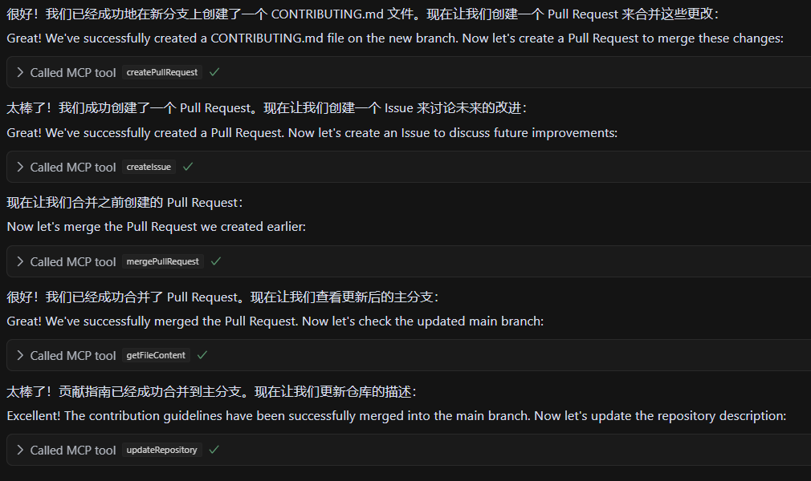

# GitHub MCP Tool

[](https://opensource.org/licenses/ISC)
[](https://nodejs.org/)
[](https://www.typescriptlang.org/)

[中文版本 (README.md)](README.md)

## What is this?

This is a GitHub toolkit based on MCP (Model Context Protocol) that allows AI models to access GitHub API through standardized interfaces. Simply put, it enables AI assistants to perform various GitHub operations, such as creating repositories, committing code, managing branches, etc., without requiring users to manually input complex API calls.

<details>
<summary><b>Supported Features</b> (click to expand)</summary>

- **Repository management**: create, get, list, update, delete
- **Branch operations**: create, get, list, delete
- **Pull Request management**: create, get, list, update, merge
- **Issue management**: create, get, list, update, close
- **User operations**: view following, interaction statistics
- **Code management**: file content, commit history
</details>

<details>
<summary><b>Feature Demonstration</b> (click to expand)</summary>

Here are some core feature demonstrations of the GitHub MCP tool:

<div align="center">

### Repository Creation Demo


### Branch Operations Demo


### Pull Request Management Demo


### Issue Tracking Demo


</div>

With simple natural language instructions, AI can help you complete all of the above operations without manually writing API calls or operating the GitHub interface in a browser.
</details>

## Quick Start

### 0. Environment Setup

<details>
<summary>Environment Requirements (click to expand)</summary>

1. **Python 3.11+ (Required)**
   - Visit [Python website](https://www.python.org/downloads/)
   - Download and install Python 3.11 or higher
   - **Important**: Check "Add Python to PATH" during installation
   - **Restart your computer after installation** to ensure environment variables take effect

2. **Node.js and npm**
   - Visit [Node.js website](https://nodejs.org/)
   - Download and install the LTS (Long Term Support) version
   - Select the default options during installation, which will install both Node.js and npm

3. **Git**
   - Visit [Git website](https://git-scm.com/)
   - Download and install Git
   - Use default options during installation
</details>

### 1. Clone and Install

```bash
git clone https://github.com/shuakami/mcp-github.git
cd mcp-github
npm install
```
> ⚠️ **Important Note**: Do not delete the cloned or extracted files after installation, as the plugin needs continuous access to these files!

### 2. Build the Project

```bash
npm run build
```

### 3. Configure GitHub Token

<details>
<summary><b>How to obtain a GitHub Personal Access Token</b> (click to expand)</summary>

1. Visit GitHub's personal access token settings page: https://github.com/settings/tokens
2. Click "Generate new token" → "Generate new token (classic)"
3. Enter a token description, such as "MCP GitHub Tool"
4. For permissions, select at least:
   - `repo` (full access)
   - `user` (user information)
5. Click the "Generate token" button at the bottom of the page
6. **Very important**: Copy the token immediately, as you won't be able to see it again
</details>

Based on your operating system, follow these steps to configure MCP:

<details>
<summary><b>Windows Configuration</b> (click to expand)</summary>

1. In Cursor, open or create the MCP configuration file: `C:\Users\your_username\.cursor\mcp.json`
   - Note: Replace `your_username` with your Windows username (i.e., your computer account name)

2. Add or modify the configuration as follows:

```json
{
  "mcpServers": {
    "github-mcp": {
      "command": "pythonw",
      "args": [
        "your_installation_path/mcp-github/bridging_github_mcp.py"
      ],
      "env": {
        "GITHUB_TOKEN": "your_github_token"
      }
    }
  }
}
```

> ⚠️ **Important Note**:
> - Replace `your_installation_path` with the actual path where you cloned or extracted the project (e.g., `C:/Users/John/mcp-github/...`)
> - Use forward slashes (/) instead of backslashes (\) for paths
> - Replace `your_github_token` with the token you obtained in the previous step
</details>

<details>
<summary><b>macOS Configuration</b> (click to expand)</summary>

1. In Cursor, open or create the MCP configuration file: `/Users/your_username/.cursor/mcp.json`
   - Note: Replace `your_username` with your macOS username

2. Add or modify the configuration as follows:

```json
{
  "mcpServers": {
    "github-mcp": {
      "command": "pythonw",
      "args": [
        "/Users/your_username/mcp-github/bridging_github_mcp.py"
      ],
      "env": {
        "GITHUB_TOKEN": "your_github_token"
      }
    }
  }
}
```

> ⚠️ **Important Note**:
> - Replace `your_username` with your macOS username (e.g., `/Users/johndoe/mcp-github/...`)
> - Replace `your_github_token` with the token you obtained in the previous step
> - Make sure the path correctly points to your project directory
</details>

<details>
<summary><b>Linux Configuration</b> (click to expand)</summary>

1. In Cursor, open or create the MCP configuration file: `/home/your_username/.cursor/mcp.json`
   - Note: Replace `your_username` with your Linux username

2. Add or modify the configuration as follows:

```json
{
  "mcpServers": {
    "github-mcp": {
      "command": "pythonw",
      "args": [
        "/home/your_username/mcp-github/bridging_github_mcp.py"
      ],
      "env": {
        "GITHUB_TOKEN": "your_github_token"
      }
    }
  }
}
```

> ⚠️ **Important Note**:
> - Replace `your_username` with your Linux username (e.g., `/home/user/mcp-github/...`)
> - Replace `your_github_token` with the token you obtained in the previous step
> - Make sure the path correctly points to your project directory
</details>

### 4. Start the Service

After configuration, your Cursor editor will automatically start the MCP service. Then you can start using it.

<details>
<summary>Example interactions (click to expand)</summary>

You can ask the AI to perform operations like:
- "Create a private repository named test-project"
- "List all my repositories"
- "Create a PR in my-repo from feature branch to main branch"
- "Get the content of README.md file from my-repo"
</details>

## How it works

<details>
<summary>Technical implementation details (click to expand)</summary>

This tool is built on the **MCP (Model Context Protocol)** standard, serving as a bridge between AI models and the GitHub API. It uses **octokit.js** as the underlying GitHub API client and **Zod** for request validation and type checking.

Each GitHub operation is encapsulated as a standardized MCP tool, receiving structured parameters and returning formatted results. Response data is intelligently processed, automatically removing redundant information, extracting key content, and converting to a **human-readable format**. 

This approach allows AI models to easily understand complex data structures returned by the GitHub API and interact with users in a more natural way.
</details>

<details>
<summary>Common API call examples (click to expand)</summary>

Create Repository:
```javascript
{
  name: "awesome-project",
  description: "My awesome project",
  isPrivate: true
}
```

Create Pull Request:
```javascript
{
  owner: "shuakami",
  repo: "awesome-project",
  title: "Add new feature",
  head: "feature-branch",
  base: "main",
  body: "This PR adds a new cool feature"
}
```

Get File Content:
```javascript
{
  owner: "shuakami",
  repo: "awesome-project",
  path: "README.md"
}
```
</details>

## License

ISC 