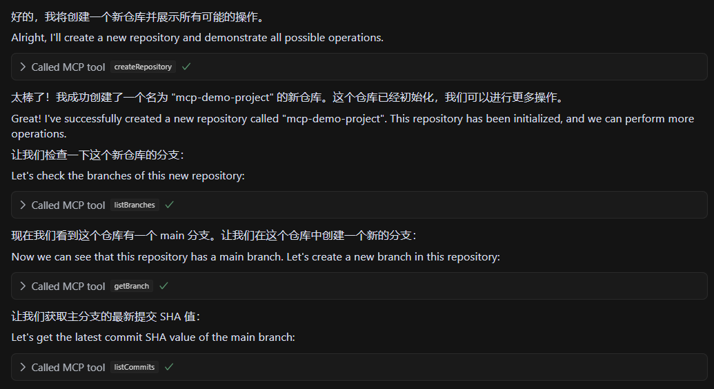
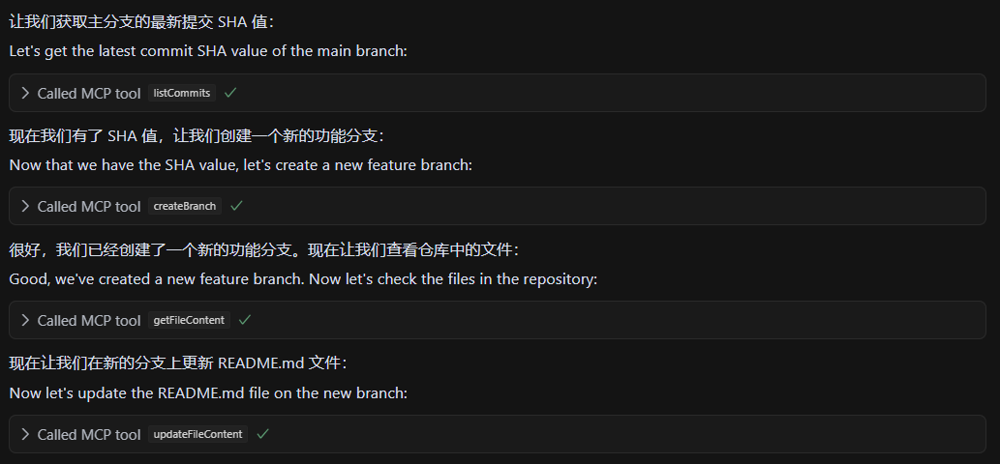
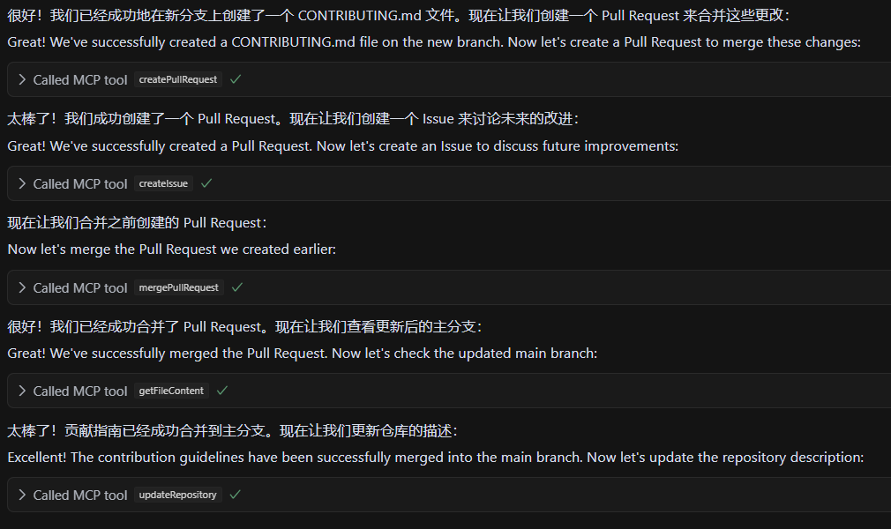
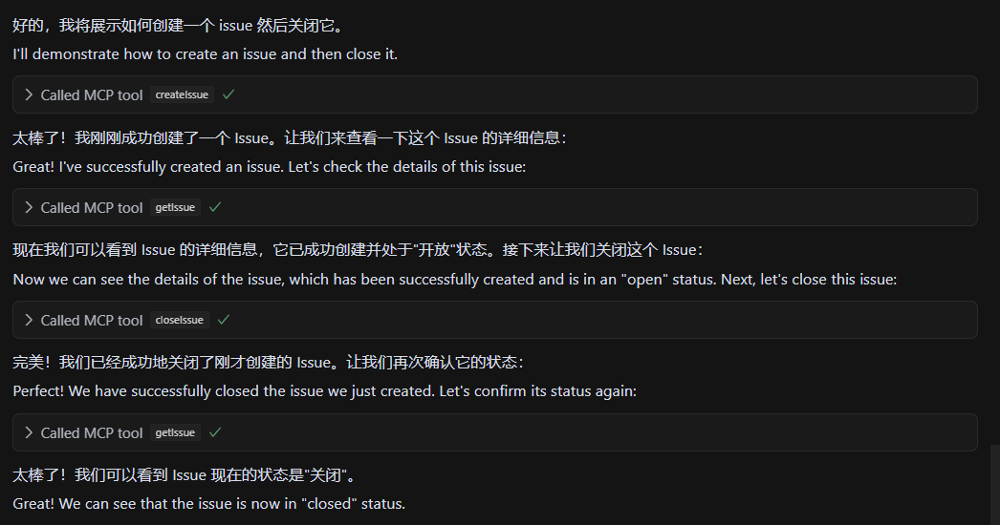

# GitHub MCP 工具

[](https://opensource.org/licenses/ISC)
[](https://nodejs.org/)
[](https://www.typescriptlang.org/)

[English Version (README-EN.md)](README-EN.md)

## 这是什么

这是一个基于 MCP (Model Context Protocol) 的 GitHub 工具，它能让 AI 模型通过标准化接口访问 GitHub API。

简单来说，它让 AI 助手能够执行各种 GitHub 操作，如创建仓库、提交代码、管理分支等，无需用户手动输入复杂的 API 调用。

<details>
<summary><b>支持的功能</b> (点击展开)</summary>

- **仓库管理**：创建、获取、列表、更新、删除
- **分支操作**：创建、获取、列表、删除
- **Pull Request 管理**：创建、获取、列表、更新、合并
- **Issue 管理**：创建、获取、列表、更新、关闭
- **用户相关操作**：查看关注、互动统计
- **代码管理**：文件内容、提交记录
</details>

<details>
<summary><b>功能演示</b> (点击展开)</summary>

以下是 GitHub MCP 工具的一些核心功能演示：

<div align="center">

### 仓库创建演示


### 分支操作演示


### Pull Request 管理演示


### Issue 跟踪演示


</div>

通过简单的自然语言指令，AI 可以帮助你完成上述所有操作，无需手动编写 API 调用或在浏览器中操作 GitHub 界面。
</details>

## 快速上手

### 0. 环境准备

<details>
<summary>环境要求 (点击展开)</summary>

1. **Python 3.11+（必需）**
   - 访问 [Python 官网](https://www.python.org/downloads/)
   - 下载并安装 Python 3.11 或更高版本
   - **重要**：安装时请勾选"Add Python to PATH"选项
   - **安装完成后请重启电脑**，确保环境变量生效

2. **Node.js 和 npm**
   - 访问 [Node.js 官网](https://nodejs.org/)
   - 下载并安装 LTS（长期支持）版本
   - 安装时选择默认选项即可，安装包会同时安装 Node.js 和 npm

3. **Git**
   - 访问 [Git 官网](https://git-scm.com/)
   - 下载并安装 Git
   - 安装时使用默认选项即可
</details>

### 1. 克隆并安装

```bash
git clone https://github.com/shuakami/mcp-github.git
cd mcp-github
npm install
npm run build
```
> ⚠️ **重要提示**：安装后请不要删除克隆或解压的文件，插件需要持续访问这些文件！

### 2. 构建项目

```bash
npm run build
```

### 3. 配置 GitHub Token

<details>
<summary><b>如何获取 GitHub 个人访问令牌</b> (点击展开)</summary>

1. 访问 GitHub 的个人访问令牌设置页面：https://github.com/settings/tokens
2. 点击 "Generate new token" → "Generate new token (classic)"
3. 输入令牌描述，例如 "MCP GitHub Tool"
4. 在权限选择中，至少勾选以下权限：
   - `repo` (完整访问权限)
   - `user` (用户信息)
5. 点击页面底部的 "Generate token" 按钮
6. **非常重要**：生成后立即复制令牌，因为你之后将无法再次查看它
</details>

根据你的操作系统，按照以下步骤配置 MCP：

<details>
<summary><b>Windows 配置</b> (点击展开)</summary>

1. 在 Cursor 中，打开或创建 MCP 配置文件：`C:\Users\你的用户名\.cursor\mcp.json`
   - 注意：请将 `你的用户名` 替换为你的 Windows 用户名（即你的电脑账户名称）

2. 添加或修改配置如下：

```json
{
  "mcpServers": {
    "github-mcp": {
      "command": "pythonw",
      "args": [
        "你的安装路径/mcp-github/bridging_github_mcp.py"
      ],
      "env": {
        "GITHUB_TOKEN": "你的GitHub令牌"
      }
    }
  }
}
```

> ⚠️ **请注意**:
> - 将 `你的安装路径` 替换为你克隆或解压项目的实际路径（例如：`C:/Users/John/mcp-github/...`）
> - 使用正斜杠（/）而非反斜杠（\）来表示路径
> - 将 `你的GitHub令牌` 替换为你在上一步中获取的实际令牌
</details>

<details>
<summary><b>macOS 配置</b> (点击展开)</summary>

1. 在 Cursor 中，打开或创建 MCP 配置文件：`/Users/你的用户名/.cursor/mcp.json`
   - 注意：请将 `你的用户名` 替换为你的 macOS 用户名

2. 添加或修改配置如下：

```json
{
  "mcpServers": {
    "github-mcp": {
      "command": "python3",
      "args": [
        "/Users/你的用户名/mcp-github/bridging_github_mcp.py"
      ],
      "env": {
        "GITHUB_TOKEN": "你的GitHub令牌"
      }
    }
  }
}
```

> ⚠️ **请注意**:
> - 将 `你的用户名` 替换为你的 macOS 用户名（例如：`/Users/johndoe/mcp-github/...`）
> - 将 `你的GitHub令牌` 替换为你在上一步中获取的实际令牌
> - 确保路径正确指向你的项目目录
</details>

<details>
<summary><b>Linux 配置</b> (点击展开)</summary>

1. 在 Cursor 中，打开或创建 MCP 配置文件：`/home/你的用户名/.cursor/mcp.json`
   - 注意：请将 `你的用户名` 替换为你的 Linux 用户名

2. 添加或修改配置如下：

```json
{
  "mcpServers": {
    "github-mcp": {
      "command": "python3",
      "args": [
        "/home/你的用户名/mcp-github/bridging_github_mcp.py"
      ],
      "env": {
        "GITHUB_TOKEN": "你的GitHub令牌"
      }
    }
  }
}
```

> ⚠️ **请注意**:
> - 将 `你的用户名` 替换为你的 Linux 用户名（例如：`/home/user/mcp-github/...`）
> - 将 `你的GitHub令牌` 替换为你在上一步中获取的实际令牌
> - 确保路径正确指向你的项目目录
</details>

### 4. 启动服务

配置好之后你的 Cursor 编辑器会自动启动 MCP 服务。然后你就可以开始用了。

<details>
<summary>示例交互 (点击展开)</summary>

你可以要求 AI 执行以下操作：
- "创建一个名为 test-project 的私有仓库"
- "列出我的所有仓库"
- "在 my-repo 仓库创建一个 PR，从 feature 分支到 main 分支"
- "获取 my-repo 中的 README.md 文件内容"
</details>

## 工作原理

<details>
<summary>技术实现细节 (点击展开)</summary>

本工具基于 **MCP (Model Context Protocol)** 标准实现，作为 AI 模型与 GitHub API 之间的桥梁。它使用 **octokit.js** 作为底层 GitHub API 客户端，并通过 **Zod** 进行请求验证和类型检查。

每个 GitHub 操作都被封装为标准化的 MCP 工具，接收结构化参数并返回格式化结果。响应数据经过智能处理，自动去除冗余信息，提取关键内容，并转换为**人类可读格式**。

这种方法使 AI 模型能够轻松理解 GitHub API 返回的复杂数据结构，并以更自然的方式与用户进行交互。
</details>

## 许可证

ISC 